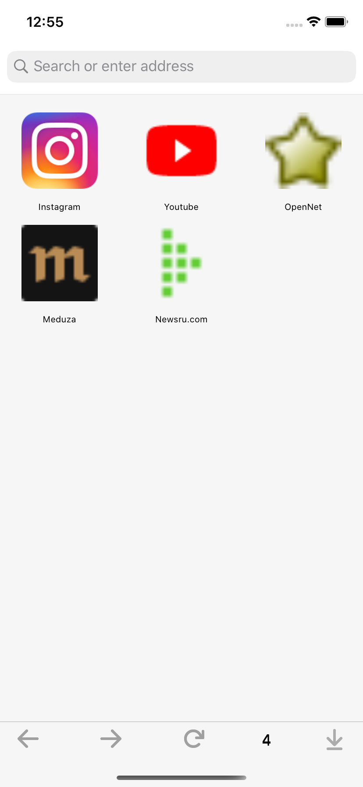
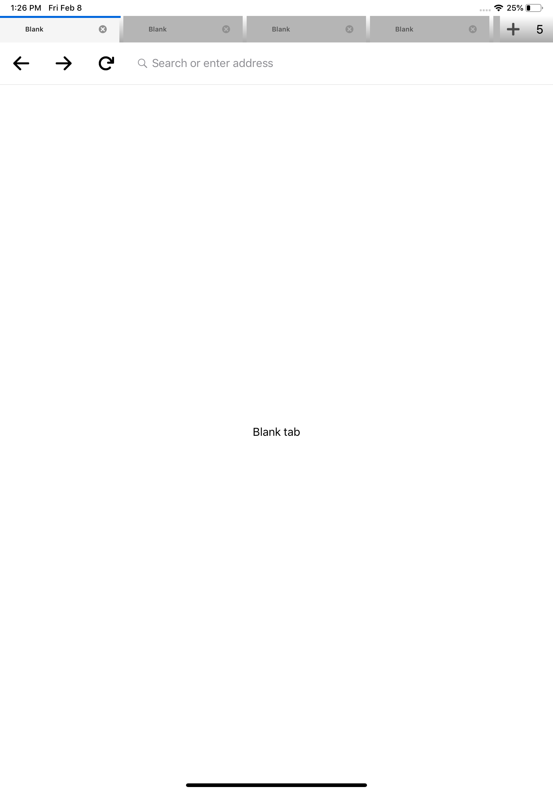
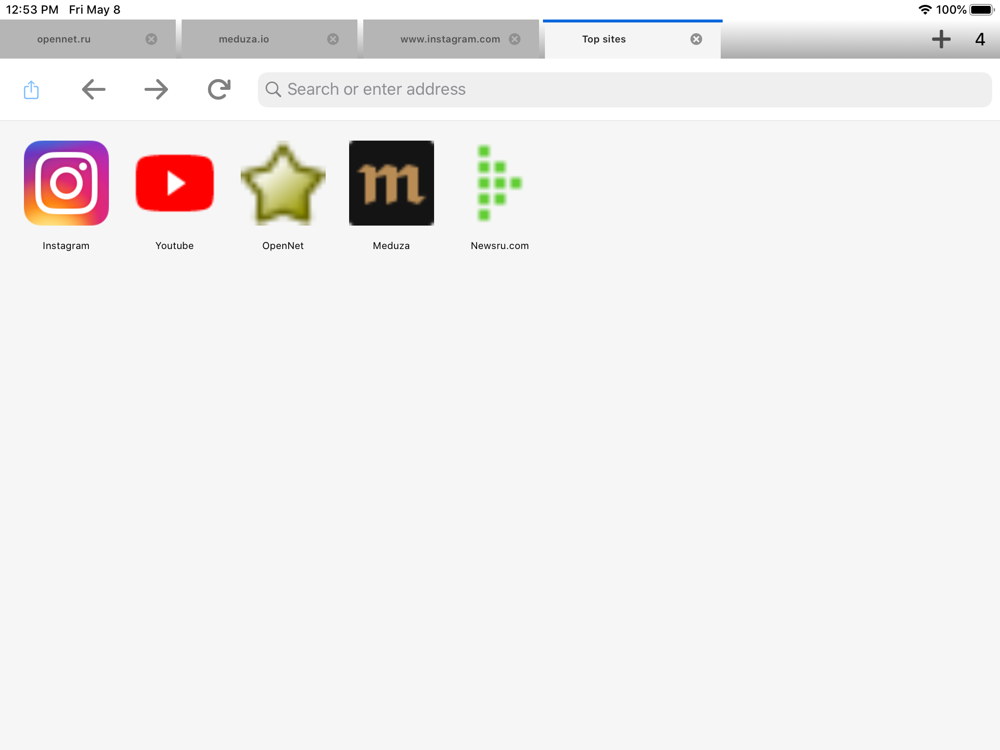

# Cotton - browser for iOS

Features
-----------------
- web search autocomplete (DuckDuckGo, google)
- DNS over https (google) alpha state (can't fully support without VPN profiles)
- tabs
- favourite sites (hardcoded for now)
- supports ipad and iphone layouts
- settings
- ability to turn off the JavaScript for each tab
- tabs cache/restore to be able to see the same web sites after app restart
- own JavaScript plugins (instagram content downloads, html video tags downloads) experimental state

Building the code
-----------------
1. cd catowser/
2. pod install
3. Open `catowser.xcworkspace`
4. Build `catowser` scheme

## Screenshots

[//]: # (CSS is filtered by Github, so style="border:5px solid black ; width:300px;" is not working for img tags)

 |  | 
--- | --- | ---

